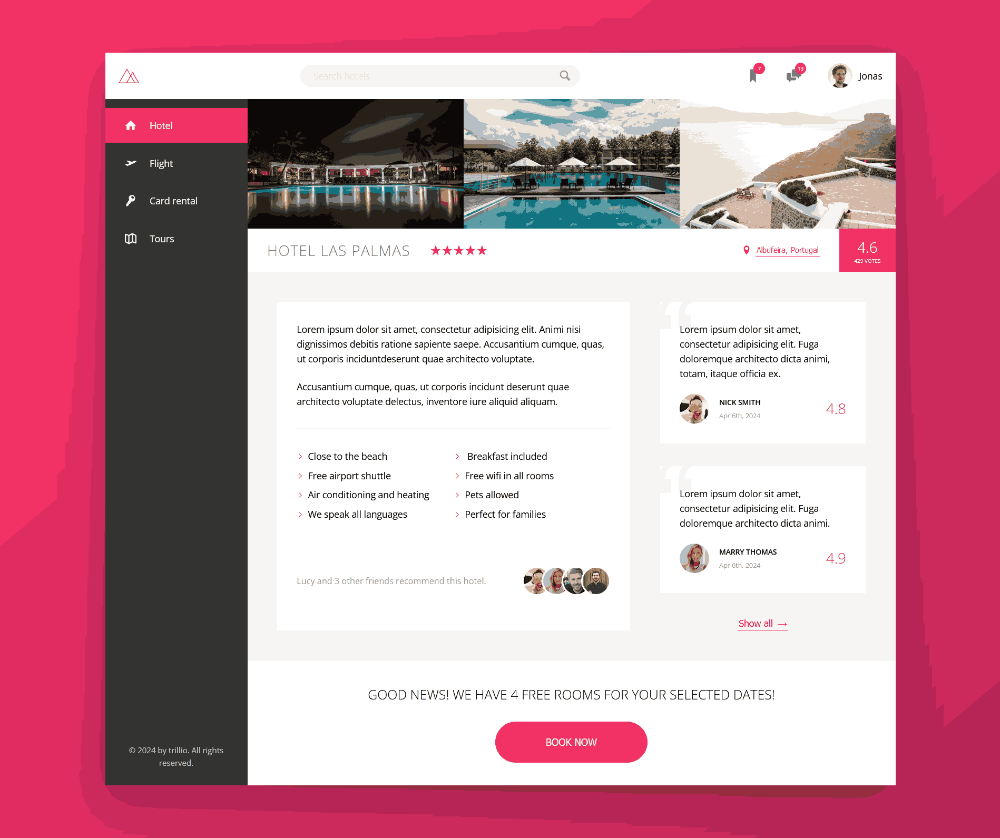

# Trillio - Your all-in-one booking app

This website was built during my first CSS advance course by Johas in the year 2024. Felt amazing to learn the concept of CSS with lots of animation and modern techniques. 

## Table of contents

- [Trillio - Your all-in-one booking app](#Trillio-Your-all-in-one-booking-app)
  - [Table of contents](#table-of-contents)
  - [Overview](#overview)
    - [Screenshot](#screenshot)
    - [Links](#links)
  - [My process](#my-process)
    - [Built with](#built-with)
  - [Author](#author)

## Overview

### Screenshot

### Links

- Solution URL: [*VIEW CODE*](https://github.com/Phurba-Sherpa/trillio)
- Live Site URL: [*PREVIEW SITE*](https://trillio.phurbasherpa.name.np/)

## My process

### Built with

- Semantic HTML5 markup
- CSS custom properties
- Flexbox
- grid
- Keyframes
- SASS
- BEM

## Author

- Website - [Phurba Sherpa](https://v2.phurba.sherpa.name.np)
- Frontend Mentor - [@Phurba-Sherpa](https://www.frontendmentor.io/profile/Phurba-Sherpa)
- Medium - [@phurba](https://medium.com/@phurba)
